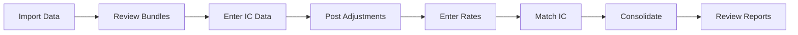
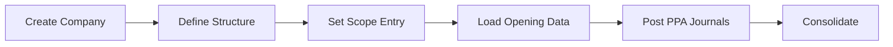
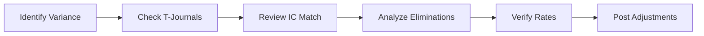

# Workflow-Theory Map: User Actions to Consolidation Phases

## Overview

This document maps user workflows in Prophix.Conso to the theoretical consolidation phases described in Allen White's "Direct Consolidation" and IFRS standards. Use this to understand which theoretical concepts apply at each step of the consolidation process.

---

## Consolidation Life Cycle

### Theory Framework (Allen White)

The theoretical consolidation process follows these phases:

```
Phase 1: Setup & Configuration
    ├── Define legal entities
    ├── Establish group structure
    └── Configure chart of accounts

Phase 2: Data Collection
    ├── Collect subsidiary data
    ├── Validate data packages
    └── Convert to group standards

Phase 3: Pre-Consolidation Adjustments
    ├── GAAP conversions
    ├── Policy alignments
    └── Error corrections

Phase 4: Currency Translation
    ├── Apply exchange rates
    ├── Translate financials
    └── Calculate translation adjustments

Phase 5: Eliminations
    ├── Participation eliminations
    ├── Intercompany eliminations
    └── Unrealized profit elimination

Phase 6: Consolidation Processing
    ├── Aggregate data
    ├── Calculate NCI
    └── Generate consolidated statements

Phase 7: Reporting
    ├── Financial statements
    ├── Disclosures
    └── Analysis reports
```

### Product Implementation

Prophix.Conso implements these phases through its menu structure and workflows:

---

## Phase-by-Phase Mapping

### Phase 1: Setup & Configuration

| Theory Concept | Product Feature | Navigation | IFRS Reference |
|---------------|-----------------|------------|----------------|
| **Entity Definition** | Company Setup | Group > Companies | - |
| **Group Structure** | Shareholding Configuration | Group > Group Structure | IFRS 10.B86 |
| **Chart of Accounts** | Account Configuration | Configuration > Accounts | IAS 1 |
| **Reporting Period** | Period Definition | Configuration > Periods | - |
| **Consolidation Scope** | Scope Selection | Group > Scope | IFRS 10.4 |

**User Workflow: Initial Setup**
```
1. Group > Companies
   → Create parent and subsidiary companies
   → Define functional currencies
   Theory: Entity identification per IFRS 10

2. Group > Group Structure
   → Enter shareholding relationships
   → Define financial and voting rights
   Theory: Control assessment per IFRS 10.5-18

3. Configuration > Accounts
   → Create group chart of accounts
   → Map local accounts to group accounts
   Theory: Uniform accounting policies per IFRS 10.19

4. Configuration > Periods
   → Define consolidation periods
   → Set period categories (Actual, Budget, Forecast)
   Theory: Reporting period alignment per IFRS 10.B92
```

---

### Phase 2: Data Collection

| Theory Concept | Product Feature | Navigation | IFRS Reference |
|---------------|-----------------|------------|----------------|
| **Subsidiary Data Package** | Bundle Entry | Data Entry > Bundles | - |
| **Data Validation** | Validation Rules | Data Entry > Validation | - |
| **Import from ERP** | Data Import | Transfers > Data > Import | - |
| **Intercompany Data** | IC Entry | Data Entry > Intercompany | - |

**User Workflow: Data Collection**
```
1. Transfers > Data > Import
   → Import trial balance data from ERP
   → Map local accounts to group accounts
   Theory: Aggregation of subsidiary data

2. Data Entry > Bundles
   → Review/adjust imported data
   → Enter opening and closing balances
   → Verify movements
   Theory: Subsidiary financial package submission

3. Data Entry > Intercompany
   → Enter intercompany transactions
   → Specify partner companies
   Theory: IC transaction identification for elimination

4. Consolidation > Statusboard
   → Verify data status (Bundle column)
   → Check completeness indicators
   Theory: Data package completeness verification
```

---

### Phase 3: Pre-Consolidation Adjustments

| Theory Concept | Product Feature | Navigation | IFRS Reference |
|---------------|-----------------|------------|----------------|
| **GAAP Conversion** | Local Adjustments | Adjustments > Local | IAS 8 |
| **Error Correction** | Restatement Journals | Adjustments > Restatement | IAS 8.41 |
| **Policy Alignment** | Group Adjustments | Adjustments > Group | IFRS 10.19 |
| **Fair Value Adjustment** | Acquisition Adjustments | Adjustments > Journal Entry | IFRS 3 |

**User Workflow: Pre-Consolidation Adjustments**
```
1. Adjustments > Local
   → Enter local GAAP to IFRS adjustments
   → Post L-type journals
   Theory: Uniform accounting policies per IFRS 10.19

2. Adjustments > Journal Entry (Type L)
   → Create manual adjustment entries
   → Reference supporting documentation
   Theory: Align subsidiary accounting to group policies

3. Adjustments > Restatement
   → Correct prior period errors
   → Post R-type journals
   Theory: Error correction per IAS 8.41

4. Review adjustment summary reports
   → Verify completeness
   → Document rationale
   Theory: Audit trail for adjustments
```

---

### Phase 4: Currency Translation

| Theory Concept | Product Feature | Navigation | IFRS Reference |
|---------------|-----------------|------------|----------------|
| **Exchange Rates** | Rate Entry | Group > Exchange Rates | IAS 21.8 |
| **Rate Types** | CC/AC/MC/HC Configuration | Configuration > Accounts | IAS 21.39-40 |
| **Translation Method** | Account Rate Assignment | Configuration > Accounts | IAS 21.38 |
| **Translation Adjustment** | CTA Calculation | Automatic (S075) | IAS 21.39(c) |

**User Workflow: Currency Translation**
```
1. Group > Exchange Rates
   → Enter/import exchange rates
   → Closing (CC), Average (AC), Historical (HC)
   Theory: IAS 21 rate selection

2. Configuration > Accounts
   → Assign rate types to accounts
   → CC for monetary items
   → AC for P&L items
   → HC for equity items
   Theory: Current rate vs temporal method

3. Run consolidation process
   → System translates at configured rates
   → Translation adjustment calculated automatically
   Theory: IAS 21.39(c) - translation difference to OCI

4. Review translation reports
   → Verify rates applied correctly
   → Review CTA movement
   Theory: Translation adjustment reconciliation
```

---

### Phase 5: Eliminations

| Theory Concept | Product Feature | Navigation | IFRS Reference |
|---------------|-----------------|------------|----------------|
| **IC Matching** | IC Reconciliation | Consolidation > Intercompany Matching | - |
| **Participation Elimination** | S088-S094 Processing | Automatic | IFRS 10.B86 |
| **IC Balance Elimination** | S082 Processing | Automatic | IFRS 10.B86(c) |
| **IC Transaction Elimination** | S083 Processing | Automatic | IFRS 10.B86(c) |
| **Dividend Elimination** | Dividend Procedures | Automatic | - |

**User Workflow: Eliminations**
```
1. Consolidation > Intercompany Matching
   → Review IC matching status
   → Investigate unmatched items
   → Apply threshold tolerance
   Theory: Full IC reconciliation before elimination

2. Handle IC differences:
   → Transfer Difference: Move to/from external
   → Reclassify Difference: P&L translation
   → Book Difference: BS translation
   Theory: IC difference resolution

3. Configuration > Eliminations
   → Review active S-codes
   → Configure U-codes if needed
   Theory: Elimination rule definition

4. Run consolidation (automatic eliminations)
   → S082: IC balance netting
   → S083: IC transaction elimination
   → S088-S094: Participation eliminations
   → S085: Minority interest
   Theory: Elimination journal generation
```

---

### Phase 6: Consolidation Processing

| Theory Concept | Product Feature | Navigation | IFRS Reference |
|---------------|-----------------|------------|----------------|
| **Run Consolidation** | Process Button | Consolidation > Statusboard | - |
| **Method Application** | G/P/E/N Processing | Automatic | IFRS 10/11/28 |
| **NCI Calculation** | Minority Processing | S085 | IFRS 10.22 |
| **T-Journal Generation** | System Journals | Automatic | - |

**User Workflow: Consolidation Processing**
```
1. Consolidation > Statusboard
   → Review status indicators
   → Bundle: ✓ = data changed
   → Adjustments: ✓ = adjustments changed
   → Conso: ✓ = needs reprocessing

2. Click "Consolidate" button
   → System processes all companies
   → Applies configured methods (G/P/E/N)
   Theory: Consolidation method application

3. Monitor consolidation log
   → Track processing status
   → Review any errors
   Theory: Process verification

4. Review T-journals (system-generated)
   → Verify elimination entries
   → Check NCI calculations
   Theory: Consolidation journal audit
```

---

### Phase 7: Reporting

| Theory Concept | Product Feature | Navigation | IFRS Reference |
|---------------|-----------------|------------|----------------|
| **Balance Sheet** | BS Report | Reports > Balance Sheet | IAS 1.54 |
| **Income Statement** | P&L Report | Reports > Profit & Loss | IAS 1.81 |
| **Cash Flow** | Cash Flow Report | Reports > Cash Flow | IAS 7 |
| **Equity Statement** | Equity Report | Reports > Equity | IAS 1.106 |
| **Consolidation Analysis** | Detail Reports | Reports > Consolidation | - |

**User Workflow: Reporting**
```
1. Reports > Balance Sheet
   → Select period and scope
   → Generate consolidated BS
   Theory: IAS 1.54 - statement of financial position

2. Reports > Profit & Loss
   → Select period and scope
   → Generate consolidated P&L
   Theory: IAS 1.81 - statement of profit/loss

3. Reports > Cash Flow
   → Select period
   → Generate consolidated cash flow
   Theory: IAS 7 - statement of cash flows

4. Reports > Consolidation
   → Company contribution analysis
   → Elimination detail reports
   → T-journal review
   Theory: Consolidation process analysis

5. Export and finalize
   → Export to Excel/PDF
   → Archive for audit
   Theory: Financial statement preparation
```

---

## Cross-Reference: Menu to Theory

### Group Menu

| Menu Item | Theory Mapping | Key Concepts |
|-----------|---------------|--------------|
| **Companies** | Entity identification | Legal entity, functional currency |
| **Group Structure** | Ownership analysis | Control, financial rights, voting rights |
| **Exchange Rates** | Translation rates | CC, AC, HC rates per IAS 21 |
| **Scope** | Consolidation perimeter | Entry/exit dates, method selection |

### Data Entry Menu

| Menu Item | Theory Mapping | Key Concepts |
|-----------|---------------|--------------|
| **Bundles** | Subsidiary data package | Trial balance, opening/closing |
| **Intercompany** | IC transaction capture | Partner identification, IC accounts |
| **Local Adjustments** | Pre-consolidation corrections | GAAP conversion, error correction |

### Consolidation Menu

| Menu Item | Theory Mapping | Key Concepts |
|-----------|---------------|--------------|
| **Statusboard** | Process control | Data status, processing triggers |
| **Intercompany Matching** | IC reconciliation | Threshold, matching, differences |
| **Events** | Scope changes | Acquisitions, disposals, restructures |
| **Eliminations** | Elimination processing | S-codes, U-codes, participation |

### Adjustments Menu

| Menu Item | Theory Mapping | Key Concepts |
|-----------|---------------|--------------|
| **Journal Entry** | Manual adjustments | L/G/E/R/T journal types |
| **Local** | Pre-consolidation | GAAP alignment |
| **Group** | Consolidation adjustments | Fair value, policy alignment |
| **Restatement** | Prior period corrections | IAS 8 error correction |

### Reports Menu

| Menu Item | Theory Mapping | Key Concepts |
|-----------|---------------|--------------|
| **Balance Sheet** | Consolidated BS | IAS 1.54 requirements |
| **Profit & Loss** | Consolidated P&L | IAS 1.81 requirements |
| **Cash Flow** | Consolidated cash flow | IAS 7 requirements |
| **Equity** | Statement of changes | IAS 1.106 requirements |
| **Consolidation** | Process analysis | Eliminations, contributions |

---

## Common User Journeys

### Journey 1: Month-End Close



**Steps**:
1. **Transfers > Data > Import** - Load ERP data
2. **Data Entry > Bundles** - Verify imported data
3. **Data Entry > Intercompany** - Enter IC transactions
4. **Adjustments > Journal Entry** - Post any adjustments
5. **Group > Exchange Rates** - Enter period rates
6. **Consolidation > Intercompany Matching** - Reconcile IC
7. **Consolidation > Statusboard > Consolidate** - Run process
8. **Reports** - Generate statements

**Theory**: Complete consolidation cycle per IFRS 10

---

### Journey 2: New Subsidiary Acquisition



**Steps**:
1. **Group > Companies** - Create new entity
2. **Group > Group Structure** - Enter ownership
3. **Group > Scope** - Set entry date and method
4. **Data Entry > Bundles** - Enter opening balances
5. **Adjustments > Journal Entry** - Post fair value adjustments
6. **Consolidation > Statusboard** - Process acquisition

**Theory**: Business combination per IFRS 3

---

### Journey 3: Investigate Consolidation Difference



**Steps**:
1. **Reports > Consolidation** - Identify variance source
2. **Reports > T-Journals** - Review system entries
3. **Consolidation > Intercompany Matching** - Check IC status
4. **Configuration > Eliminations** - Review S-code settings
5. **Group > Exchange Rates** - Verify rates
6. **Adjustments > Journal Entry** - Correct if needed

**Theory**: Consolidation difference analysis

---

## Theory Concepts Quick Reference

| Concept | Definition | Product Feature |
|---------|------------|-----------------|
| **Control** | Power + Variable Returns + Link | Group Structure > Method |
| **Significant Influence** | 20-50% presumption | Method = E |
| **Joint Control** | Unanimous consent | Method = P |
| **Functional Currency** | Primary economic environment | Company > Currency |
| **Presentation Currency** | Group reporting currency | Group-level setting |
| **Goodwill** | Excess of consideration over FV | S088-S094 elimination |
| **NCI** | Non-controlling interest | S085 elimination |
| **CTA** | Currency translation adjustment | S075 translation |
| **IC Elimination** | Remove intercompany | S082, S083 |

---

## Related Documentation

- [Field Definitions](field-definitions.md) - UI field to theory mapping
- [Screen Glossary](screen-glossary.md) - Screen-level explanations
- [Elimination Differences](../discrepancy-mapping/elimination-differences.md)
- [Ownership Differences](../discrepancy-mapping/ownership-differences.md)
- [Currency Differences](../discrepancy-mapping/currency-differences.md)
- [Help Index](../help-index.md) - User documentation

---

*Workflow-Theory Map | Version 1.0 | Last Updated: 2024-12-03*
