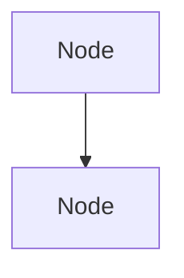

# Mermaid Diagram Support - Implementation Plan

## Overview

Add Mermaid.js diagram generation to the Product Owner RAG application to visually explain financial consolidation concepts. Diagrams will be generated by Claude and rendered in the Streamlit interface.

## Scope

- **In Scope**: Standard and Detailed explanation levels only
- **Out of Scope**: Executive Summary (remains fast/text-only)

---

## Phase 1: Install Dependencies

**Time Estimate**: 10 minutes

### Tasks

1. Add `streamlit-mermaid` to `requirements.txt`
2. Rebuild Docker container

### Files Modified

- `product-owner-rag/requirements.txt`

### Verification

```bash
cd /mnt/c/Work/direct-consolidation-docs/md/chromadb-docker
docker-compose build product-owner-rag
```

---

## Phase 2: Update System Prompts

**Time Estimate**: 30 minutes

### Tasks

1. Locate `EXPLANATION_PROMPTS` dictionary in `app.py` (around line 115-160)
2. Add Mermaid instructions to **Standard** prompt
3. Add Mermaid instructions to **Detailed** prompt
4. Do NOT modify Executive Summary prompt

### Prompt Guidelines to Add

```
When explaining complex concepts, include Mermaid diagrams to aid understanding.

Use diagrams for:
- Ownership hierarchies and group structures (graph TD)
- Consolidation workflows and processes (flowchart)
- Decision trees for method selection (graph TD)
- Step-by-step procedures (sequenceDiagram)
- Ownership percentage breakdowns (pie)

Format diagrams as:


Only include diagrams when they genuinely aid understanding. Simple definitions do not need diagrams.
```

### Files Modified

- `product-owner-rag/app.py` - `EXPLANATION_PROMPTS` dictionary

---

## Phase 3: Create Mermaid Rendering Function

**Time Estimate**: 1 hour

### Tasks

1. Create `render_response_with_mermaid()` function
2. Implement Mermaid block detection using regex
3. Implement rendering using `streamlit-mermaid` or custom HTML
4. Add fallback for invalid syntax

### Function Specification

```python
def render_response_with_mermaid(response_text: str) -> None:
    """
    Render a response that may contain Mermaid diagram blocks.

    - Splits response into text and mermaid segments
    - Renders text with st.markdown()
    - Renders mermaid blocks with st_mermaid() or custom HTML
    - Falls back to code block display if mermaid syntax is invalid

    Args:
        response_text: The full response from Claude, may contain ```mermaid blocks
    """
```

### Regex Pattern for Detection

```python
MERMAID_PATTERN = r'```mermaid\s*([\s\S]*?)```'
```

### Fallback Behavior

If Mermaid rendering fails:
1. Log the error
2. Display the diagram code in a code block with syntax highlighting
3. Show a subtle warning: "Diagram could not be rendered"

### Files Modified

- `product-owner-rag/app.py` - new function

---

## Phase 4: Integrate with Response Display

**Time Estimate**: 1 hour

### Current Flow

```
query → search → stream response → st.write_stream() → display
```

### New Flow

```
query → search → stream response → st.write_stream() → post_process_mermaid() → display diagrams
```

### Tasks

1. After `answer = st.write_stream(stream_generator)` completes
2. Check if answer contains ```mermaid blocks
3. If yes, re-render the response using `render_response_with_mermaid()`
4. Handle the UX transition smoothly

### Implementation Options

**Option A: Post-render replacement**
- Let streaming complete normally
- Then scan for mermaid blocks and render them below

**Option B: Split rendering**
- Stream text portions
- Render diagrams as separate components after streaming

**Recommended**: Option A (simpler, less disruptive to existing code)

### Files Modified

- `product-owner-rag/app.py` - query processing section (around line 3420-3450)

---

## Phase 5: Add Dark Theme Styling

**Time Estimate**: 30 minutes

### Tasks

1. Add CSS for Mermaid diagram containers
2. Configure Mermaid theme to match app's dark theme
3. Add responsive styling for mobile

### CSS to Add

```css
/* Mermaid diagram container */
.mermaid-container {
    background-color: #161B22;
    border: 1px solid #30363D;
    border-radius: 8px;
    padding: 16px;
    margin: 16px 0;
    overflow-x: auto;
}

.mermaid-container svg {
    max-width: 100%;
    height: auto;
}

/* Dark theme for Mermaid */
.mermaid {
    background: transparent;
}
```

### Mermaid Theme Configuration

```javascript
mermaid.initialize({
    theme: 'dark',
    themeVariables: {
        primaryColor: '#5B7FFF',
        primaryTextColor: '#C9D1D9',
        primaryBorderColor: '#30363D',
        lineColor: '#8B949E',
        secondaryColor: '#21262D',
        tertiaryColor: '#161B22'
    }
});
```

### Files Modified

- `product-owner-rag/app.py` - CSS section and/or Mermaid initialization

---

## Phase 6: Testing

**Time Estimate**: 30 minutes

### Test Cases

#### Should Generate Diagrams (Standard/Detailed)

| Question | Expected Diagram Type |
|----------|----------------------|
| "Explain the consolidation workflow" | flowchart |
| "How does ownership flow in multi-tier structures?" | graph TD |
| "Compare global integration vs equity method" | graph LR or flowchart |
| "What are the steps in the elimination process?" | sequenceDiagram |
| "How is NCI calculated in an 80/20 split?" | pie (optional) |

#### Should NOT Generate Diagrams

| Question | Reason |
|----------|--------|
| Any question in Executive Summary mode | Mode excludes diagrams |
| "What is goodwill?" | Simple definition |
| "What does IFRS 10 say about control?" | Reference/factual |

#### Edge Cases

| Test | Expected Behavior |
|------|-------------------|
| Invalid Mermaid syntax | Falls back to code block display |
| Multiple diagrams in response | All render correctly |
| Very large diagram | Scrollable container |
| Empty mermaid block | Gracefully ignored |

### Manual Testing Checklist

- [ ] Standard mode generates diagrams for complex questions
- [ ] Detailed mode generates diagrams for complex questions
- [ ] Executive Summary does NOT generate diagrams
- [ ] Diagrams render with dark theme
- [ ] Invalid syntax shows fallback code block
- [ ] Mobile view is usable (scrollable)
- [ ] Diagrams appear after streaming completes
- [ ] Copy/Download/Print still work correctly

---

## Phase 7: Rebuild & Deploy

**Time Estimate**: 10 minutes

### Commands

```bash
cd /mnt/c/Work/direct-consolidation-docs/md/chromadb-docker

# Rebuild
docker-compose build product-owner-rag

# Restart
docker-compose --profile with-rag down
docker-compose --profile with-rag up -d

# Verify
docker logs fc-product-owner-rag
```

### Verification

1. Open http://localhost:8501
2. Set explanation level to "Standard" or "Detailed"
3. Ask: "Explain the consolidation workflow step by step"
4. Verify diagram renders correctly

---

## Technical Reference

### Key Files

| File | Purpose |
|------|---------|
| `product-owner-rag/app.py` | Main application code |
| `product-owner-rag/requirements.txt` | Python dependencies |
| `chromadb-docker/docker-compose.yml` | Container configuration |
| `product-owner-rag/Dockerfile` | Container build instructions |

### Key Code Locations in app.py

| Component | Approximate Line |
|-----------|------------------|
| `EXPLANATION_PROMPTS` | 115-160 |
| CSS styles | 200-500 |
| `generate_answer_streaming()` | 1050-1150 |
| Query processing / response display | 3400-3500 |

### Dependencies

| Package | Purpose |
|---------|---------|
| `streamlit-mermaid` | Render Mermaid diagrams in Streamlit |

Alternative: Custom HTML component with Mermaid.js CDN if `streamlit-mermaid` has issues.

---

## Rollback Plan

If issues arise:

1. Remove Mermaid instructions from `EXPLANATION_PROMPTS`
2. Remove/comment out `render_response_with_mermaid()` function
3. Rebuild container

No database or knowledge base changes required - all changes are in application code.

---

## Future Enhancements (Out of Scope)

- User toggle to enable/disable diagrams
- Diagram export as PNG/SVG
- Interactive diagrams (click to explore)
- Diagram caching to avoid re-rendering
